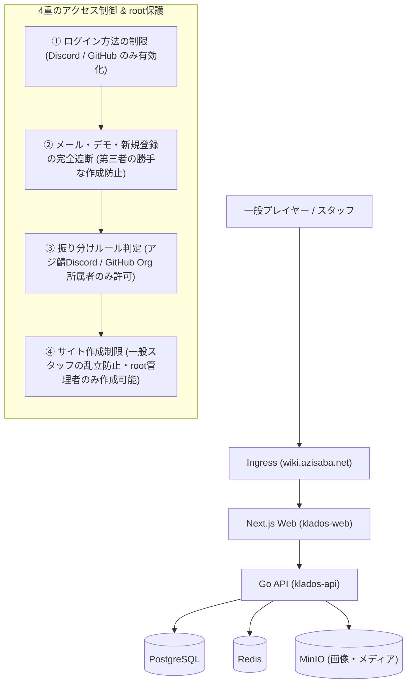

# アジ鯖公式Wiki 最速Kubernetesプライベート公開手順書

本手順書は、**Klados** を Kubernetes（k8s）クラスタ上に最速でデプロイし、**アジ鯖（Azisaba）の運営・スタッフ・Wiki担当者以外の第三者が一切ログイン・改ざん・個人サイト作成できないよう強固に保護された公式Wiki環境** を構築するための最新完全ガイドです。

---

## 1. 全体アーキテクチャとセキュリティ設計



### 本システムが提供する強力なセキュリティ
1. **ログイン画面の最適化**:
   - メールフォームやパスワード入力欄を完全非表示。画面中央には公式Discord/GitHubのボタンのみが並びます。
2. **第三者の新規登録・ログイン完全遮断 (`restrict_to_rules: true`)**:
   - アジ鯖公式DiscordサーバーやGitHub組織に所属していない一般プレイヤーは、ログインを試みても `403 Forbidden` で弾かれます。
3. **スタッフ権限の自動付与（Auth Routing）**:
   - スタッフがDiscordログインするだけで、「アジ鯖公式Wiki」の編集権限（Editor）が自動付与されます。個別招待の手間はゼロです。
4. **個人サイト乱立の防止 (`only_root_can_create_sites: true`)**:
   - root管理者以外の一般スタッフは、勝手に新しい個人Wikiを作成できず、与えられた公式Wikiのみを編集できます。

---

## 2. 最速セットアップ手順（6ステップ）

### 【Step 1】コンテナイメージのビルド & プッシュ

```bash
# レジストリ変数（例: ghcr.io/azisaba）
export REGISTRY="ghcr.io/your-org"

# 1. API (Go) のビルド & プッシュ
docker build -t ${REGISTRY}/klados-api:latest -f apps/api/Dockerfile apps/api
docker push ${REGISTRY}/klados-api:latest

# 2. Web (Next.js) のビルド & プッシュ
docker build -t ${REGISTRY}/klados-web:latest \
  --build-arg NEXT_PUBLIC_API_URL=/v1 \
  -f apps/web/Dockerfile apps/web
docker push ${REGISTRY}/klados-web:latest
```

---

### 【Step 2】マニフェストの設定変更

リポジトリ内の `k8s/all-in-one.yaml` を開きます。

1. **ドメイン名**:
   - `wiki.azisaba.net` を実際の運用ドメインに置き換えます。
2. **パスワード・シークレット**:
   - `JWT_SECRET`, `POSTGRES_PASSWORD`, `MINIO_ROOT_PASSWORD` を安全なランダム文字列に変更します。
3. **root管理者（初期設定）**:
   - `klados-config` の `ROOT_EMAIL` / `ROOT_USERNAME` に、あなたのメールアドレスまたはユーザー名を指定します（※未指定でも、初期ユーザー0人の状態で最初に登録した人が自動でrootになります）。
4. **イメージ名**:
   - `ghcr.io/your-org/klados-api:latest`
   - `ghcr.io/your-org/klados-web:latest`
   を Step 1 のイメージ名に更新します。

---

### 【Step 3】Kubernetes クラスタへ一発デプロイ

```bash
# ネームスペース作成から全リソースの起動まで1コマンドで完了
kubectl apply -f k8s/all-in-one.yaml

# ポッドの起動状況を確認 (すべて Running になればOK)
kubectl get pods -n klados -w
```

---

### 【Step 4】初期管理者（root）アカウントの作成

1. ブラウザで `https://wiki.azisaba.net/register` にアクセスします。
2. 最初の管理者アカウント（メールアドレス・ユーザー名・パスワード）を入力して登録します。
   - **ポイント**: データベースにユーザーがまだ0人の状態であるため、**自動的にこのアカウントが最高権限の `root` システム管理者として昇格** されます。
3. ダッシュボードの右上に「**root**」バッジが表示されていることを確認します。

---

### 【Step 5】「⚡ 推奨プリセット」で一撃セキュリティ構成

1. ダッシュボード右上メニュー →「**認証・SSO**（`/dashboard/settings/auth`）」を開きます。
2. ページ上部の紫色のバナーにある **「⚡ 推奨プリセットを適用」** ボタンをクリックします。
   - これにより以下の設定が自動的にフォームへ反映されます：
     - **サイト新規作成を root 管理者のみに制限**: **ON**
     - **メールアドレス / パスワードログイン**: **OFF**（フォームが隠れ、APIも遮断）
     - **メール新規登録**: **OFF**（第三者による勝手な登録を完全遮断）
     - **ワンクリックデモログイン**: **OFF**（本番用）
     - **Googleログイン**: **OFF**
     - **GitHub OAuth ログイン**: **ON**
     - **Discord OAuth ログイン**: **ON**
     - **ルール一致ユーザーのみログイン許可**: **ON**（未所属の第三者を完全拒絶）
     - **メール確認必須化**: **OFF**（メールサーバー設定不要でDiscord認証即時利用可）
3. ページ下部の **「設定を保存する」** をクリックします。

> これ以降、ログイン画面（`/login`）を開くと、メールフォームが消え、GitHubとDiscordのOAuthボタンのみが中央に並ぶクリーンで堅牢な画面になります。

---

### 【Step 6】公式Wikiサイト & Discord振り分けルールの作成

#### 1. 公式Wikiサイトの作成（rootのみ作成可能）
1. 「ダッシュボード」に戻り、「**新しいサイトを作成**」をクリック。
2. サイト名: `アジ鯖公式Wiki`、スラグ: `azisaba`、説明を入力して作成。
3. サイト設定で「**全体公開 (Public)**」をONにしておきます（一般プレイヤーはログインなしで閲覧のみ可能）。

#### 2. Discord / GitHub 振り分けルールの登録
1. 「**認証・SSO**」画面に戻り、「**+ 新規ルールを追加**」をクリック。
2. **アジ鯖公式Discordサーバー所属ルール**:
   - ルール名: `アジ鯖公式Discordメンバー`
   - プロバイダ: `Discord`
   - 判定タイプ: `Discord サーバー (名/ID)`
   - 判定する値: `アジ鯖` （または Discord サーバーの Guild ID）
   - 所属させるサイト: `アジ鯖公式Wiki`
   - 付与するロール: `Editor`（編集者）
   - 自動メール認証: **ON**
   - 「保存する」をクリック。
3. **GitHub運営組織ルール（任意）**:
   - ルール名: `アジ鯖運営チーム`
   - プロバイダ: `GitHub`
   - 判定タイプ: `GitHub 組織名 (Org)`
   - 判定する値: `azisaba`
   - 所属サイト: `アジ鯖公式Wiki`
   - 付与するロール: `Admin`（Wiki管理者）
   - 「保存する」をクリック。

---

## 3. アジ鯖スタッフのログイン動作

スタッフやWiki編集者が `https://wiki.azisaba.net/login` にアクセスした場合の流れ：

1. 画面の「**Discord**」ボタンをクリック。
2. Discordで認証を許可。
3. **アジ鯖Discordサーバーに所属している場合**:
   - ログイン成功！
   - アカウントが自動作成され、即座に「アジ鯖公式Wiki」の **Editor（編集権限）** が付与される。
   - 招待状の発行や手動での権限付与は一切不要。
4. **アジ鯖Discordサーバーに所属していない一般第三者の場合**:
   - `403 Forbidden: 許可された組織または承認済みメールドメインのユーザーのみログインできます` と表示され、システム内に一切侵入できません。

---

## 4. 便利な運用・バックアップコマンド集

```bash
# 1. API ログのリアルタイム監視
kubectl logs -n klados -l app=klados-api -f

# 2. Web ログの監視
kubectl logs -n klados -l app=klados-web -f

# 3. データベースのバックアップ (SQL Dump)
kubectl exec -n klados deployment/klados-postgres -- pg_dump -U klados klados > azisaba_wiki_backup.sql

# 4. データベースのリストア
cat azisaba_wiki_backup.sql | kubectl exec -i -n klados deployment/klados-postgres -- psql -U klados klados

# 5. Pod の再起動（設定反映など）
kubectl rollout restart deployment/klados-api -n klados
kubectl rollout restart deployment/klados-web -n klados
```
