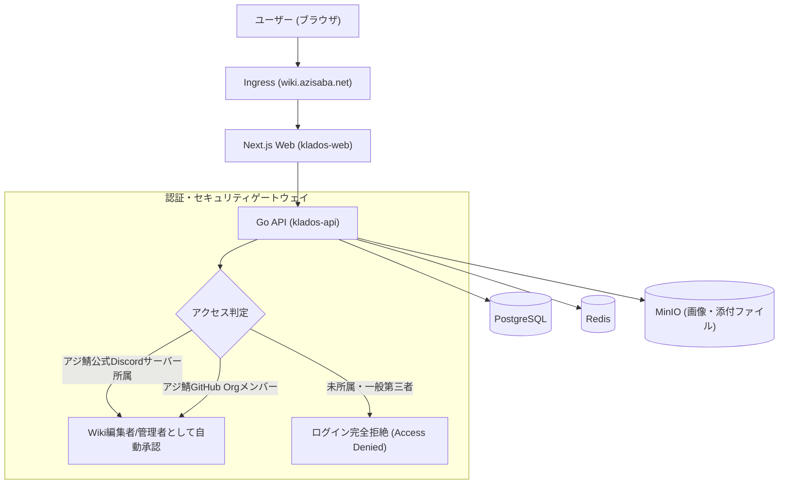

# アジ鯖公式Wiki 最速Kubernetesプライベート公開手順書

本手順書は、**Klados** を Kubernetes（k8s）クラスタ上に最速でデプロイし、**アジ鯖（Azisaba）の運営・スタッフ・Wiki担当者以外の第三者が一切ログイン・改変できないよう強固にアクセス制限をかけたプライベート/公式Wiki環境** を構築するための完全ガイドです。

---

## 1. 全体アーキテクチャとセキュリティ設計

### なぜ「組織ログイン & 自動振り分け」が生きるのか？

アジ鯖公式Wikiとして運用する場合、最大の課題は「**誰に編集権限を与え、どのように不正なログインや改ざんを防ぐか**」です。



### 3重のセキュリティ防御壁
1. **第三者のログイン遮断（`restrict_to_rules: true`）**:
   - 振り分けルール（アジ鯖Discord / GitHub Org）に合致しない一般ユーザーは、**新規登録・ログインがシステムレベルで即座に拒否**されます。
2. **スタッフ権限の自動付与（Auth Routing）**:
   - アジ鯖の公式Discordサーバーのメンバー（または特定ロール保有者）がDiscordログインするだけで、対象Wikiサイトの `Editor`（編集者）または `Admin`（管理者）ロールが自動付与されます。個別招待の手間がゼロになります。
3. **一般プレイヤー向けの公開設定**:
   - Wikiの閲覧は「全プレイヤーに公開（閲覧のみ許可・編集不可）」、もしくは「合言葉（パスワード）を知っているテスターのみ閲覧可能」のどちらでも自由に切り替え可能です。

---

## 2. 最速デプロイ手順（5ステップ）

### 【Step 1】コンテナイメージのビルド & プッシュ

ローカルまたは CI/CD（GitHub Actions）で、API と Web のコンテナイメージをビルドしてコンテナレジストリ（GitHub Packages / Docker Hub / 自前レジストリ）にプッシュします。

```bash
# レジストリ変数（例: ghcr.io/azisaba）
export REGISTRY="ghcr.io/your-org"

# 1. API (Go) のビルド & プッシュ
docker build -t ${REGISTRY}/klados-api:latest -f apps/api/Dockerfile apps/api
docker push ${REGISTRY}/klados-api:latest

# 2. Web (Next.js) のビルド & プッシュ
# ※ NEXT_PUBLIC_API_URL はブラウザからの相対パス '/v1' を指定（Next.js が内部プロキシ）
docker build -t ${REGISTRY}/klados-web:latest \
  --build-arg NEXT_PUBLIC_API_URL=/v1 \
  -f apps/web/Dockerfile apps/web
docker push ${REGISTRY}/klados-web:latest
```

---

### 【Step 2】マニフェストの設定変更

リポジトリ内の [`k8s/all-in-one.yaml`](file:///c:/Users/user/Desktop/Klados/k8s/all-in-one.yaml) を開き、以下の箇所を用途に合わせて編集します。

1. **ドメイン名**:
   - `wiki.azisaba.net` を実際の運用ドメインに置き換えます。
2. **パスワード・シークレット**:
   - `JWT_SECRET`, `POSTGRES_PASSWORD`, `MINIO_ROOT_PASSWORD` を安全なランダム文字列に変更します。
3. **イメージ名**:
   - `ghcr.io/your-org/klados-api:latest`
   - `ghcr.io/your-org/klados-web:latest`
   を Step 1 でプッシュしたイメージ名に更新します。

---

### 【Step 3】Kubernetes クラスタへ一発デプロイ

```bash
# ネームスペース作成から全リソースの起動まで1コマンドで完了
kubectl apply -f k8s/all-in-one.yaml

# ポッドの起動状況を確認
kubectl get pods -n klados -w
```

すべての Pod が `Running` になれば、インフラ側の準備は完了です。

---

### 【Step 4】Discord / GitHub OAuth アプリの作成

アジ鯖メンバーがワンクリックで認証できるように、Discord または GitHub の OAuth アプリを作成します。

#### Discord Developer Portal での設定
1. [Discord Developer Portal](https://discord.com/developers/applications) を開く。
2. 「New Application」を作成（例: `Azisaba Wiki`）。
3. 「OAuth2」→「Redirects」に以下を追加：
   - `https://wiki.azisaba.net/login`
   - `https://wiki.azisaba.net/api/auth/callback/discord`
4. Client ID と Client Secret を控える。

---

### 【Step 5】第三者ログイン遮断 & 組織振り分けルールの設定

デプロイ完了後、初期管理者アカウントでログインし、ダッシュボードからアジ鯖専用のセキュリティルールを設定します。

1. ブラウザで `https://wiki.azisaba.net` を開く。
2. 右上メニュー →「**認証・SSO**（`/dashboard/settings/auth`）」を開く。
3. **メールアドレス認証ポリシー**:
   - **メール確認を必須にする**: **オフ（任意）**
     - メールサーバー（SMTP）を立てる必要がなく、Discord/GitHub ログインで即時利用可能になります。
   - **ルール一致ユーザーのみログイン許可**: **オン（チェックを入れる）**
     - これにより、**下記で設定するアジ鯖ルールに一致しない一般の第三者は一切ログインできなくなります**。
   - 「設定を保存する」をクリック。
4. **自動振り分けルールを追加（アジ鯖スタッフ用）**:
   - 「**+ 新規ルールを追加**」をクリック。
   - **ルール例 1: アジ鯖公式Discordサーバー所属者**
     - ルール名: `アジ鯖公式Discordメンバー`
     - プロバイダ: `Discord`
     - 判定タイプ: `Discord サーバー (名/ID)`
     - 判定する値: `アジ鯖` （または Discord サーバーの Guild ID）
     - 所属させるサイト: `アジ鯖公式Wiki`
     - 付与するロール: `Editor`（編集者）または `Admin`（管理者）
     - 自動メール認証: **ON**
   - **ルール例 2: GitHub 運営組織メンバー**
     - ルール名: `アジ鯖開発・運営チーム`
     - プロバイダ: `GitHub`
     - 判定タイプ: `GitHub 組織名 (Org)`
     - 判定する値: `azisaba`
     - 所属させるサイト: `アジ鯖公式Wiki`
     - 付与するロール: `Admin`（サイト管理者）
5. **振り分けシミュレーターでテスト**:
   - 画面下のシミュレーターで、プロバイダ `Discord`、サーバー名 `アジ鯖` を入れて「判定テスト実行」をクリック。
   - `✓ メール自動認証対象` かつ `アジ鯖公式Wiki (Editor)` と判定されれば設定完了です！

---

## 3. Wikiの一般公開と編集保護の切り替え

アジ鯖公式Wikiの運用形態に応じて、サイト設定から以下を自由に切り替えられます：

| 運用スタイル | サイトの公開設定 (`is_public`) | 閲覧者 | 編集・管理権限 |
| :--- | :--- | :--- | :--- |
| **A. 一般プレイヤー公開（推奨）** | **公開 (Public)** | 誰でも自由に閲覧可能 | アジ鯖Discord/GitHub認証者のみ可能 |
| **B. 完全関係者限定（社内・準備中）** | **非公開 (Private)** または **パスワード保護** | ログイン済みの関係者、または合言葉を知る人のみ | アジ鯖Discord/GitHub認証者のみ可能 |

サイトの個別設定画面（`/dashboard/sites/<id>/settings`）から、パスワード保護や公開/非公開をワンクリックで切り替え可能です。

---

## 4. 便利な運用・メンテナンスコマンド

```bash
# ログ確認 (API)
kubectl logs -n klados -l app=klados-api -f

# ログ確認 (Web)
kubectl logs -n klados -l app=klados-web -f

# データベースのバックアップ (Dump)
kubectl exec -n klados deployment/klados-postgres -- pg_dump -U klados klados > azisaba_wiki_backup.sql

# データベースのリストア
cat azisaba_wiki_backup.sql | kubectl exec -i -n klados deployment/klados-postgres -- psql -U klados klados
```
